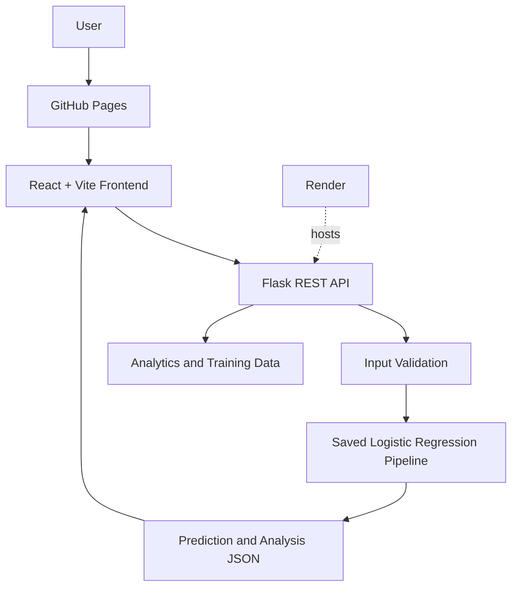

# Loan Approval Prediction Using Logistic Regression

LoanPredict AI is a full-stack machine learning application that predicts loan approval outcomes with a saved scikit-learn Logistic Regression pipeline. The React and Vite frontend provides interactive prediction, analytics, and model-visualization pages, while a Flask REST API performs validation and inference.

## 🚀 Live Demo

- **Frontend:** [GitHub Pages](https://khilarionkar05.github.io/loan-approval-prediction-logistic-regression/)
- **Backend:** [Render service](https://loan-approval-backend-live.onrender.com)
- **Health check:** [`/health`](https://loan-approval-backend-live.onrender.com/health)
- **Repository:** [GitHub](https://github.com/khilarionkar05/loan-approval-prediction-logistic-regression)

The frontend is deployed on GitHub Pages and the Flask ML backend is deployed on Render.

## Project Overview

Users enter applicant and loan information through the React frontend. The frontend sends the input as JSON to the Flask backend, which validates the fields and passes them through the saved preprocessing and Logistic Regression pipeline loaded from `backend/loan_model.pkl`. The API returns an approval or rejection prediction, probability, model score, and analysis values used by the frontend visualizations.

Logistic Regression is used because it is a suitable, interpretable method for binary classification. Its learned coefficients make it possible to show how processed features contribute to the final decision.

## Features

- Loan approval prediction from applicant and loan details
- Logistic Regression inference using a saved scikit-learn pipeline
- Interactive React frontend with responsive layouts
- Analytics dashboard with dataset distribution, evaluation results, confusion matrix, and learned coefficients
- Training-data endpoint and historical-data visualization
- Live ML visualization of preprocessing, feature values, score, probability, and decision
- Model information page describing preprocessing and model formulation
- Flask REST API with JSON responses and health check
- GitHub Pages frontend deployment through GitHub Actions
- Render deployment for the Flask backend

## Technology Stack

| Category | Technology |
| --- | --- |
| Frontend | React 19, React Router DOM |
| Build tool | Vite |
| Backend | Python, Flask, Flask-CORS |
| Machine learning | scikit-learn |
| ML algorithm | Logistic Regression |
| Data processing | Pandas, NumPy |
| Model serialization | Joblib |
| API | REST API over JSON |
| Frontend hosting | GitHub Pages |
| Backend hosting | Render |
| Version control | Git, GitHub |

## System Architecture



## 🤖 Machine Learning Model

- **Algorithm:** Logistic Regression
- **Learning type:** Supervised learning
- **Problem type:** Binary classification
- **Inputs:** Gender, marital status, dependents, education, self-employment status, income, loan amount, loan term, credit history, and property area
- **Output:** Approved or Rejected, with an approval probability

The backend preprocesses categorical and numerical features before passing them to the classifier. Logistic Regression computes a linear score, then maps that score to a probability using the sigmoid function:

```text
P(y=1|x) = 1 / (1 + e^(-z))
```

The application compares the resulting probability with its classification threshold to determine the predicted class. The same prediction response also contains intermediate values used by the Live ML and model-information views.

## Project Workflow

1. The user opens the React application.
2. The user enters loan and applicant information.
3. React validates the form and constructs the existing prediction request fields.
4. The frontend sends a `POST` request to the Flask `/predict` endpoint.
5. Flask validates the JSON input and loads the saved pipeline at startup.
6. The pipeline preprocesses the features and generates a probability and class prediction.
7. Flask returns the prediction and analysis values as JSON.
8. React displays the approval result and stores the analysis for the Live ML view.
9. Analytics, training-data, and model-information pages request their corresponding backend data.

## Project Structure

```text
loan-approval-prediction-logistic-regression/
├── backend/
│   ├── app.py
│   ├── loan_model.pkl
│   ├── requirements.txt
│   ├── runtime.txt
│   └── data/
│       └── loan_data.csv
├── public/
│   ├── favicon.svg
│   └── icons.svg
├── src/
│   ├── assets/
│   ├── components/
│   │   ├── Footer.jsx
│   │   └── Header.jsx
│   ├── config/
│   │   └── api.js
│   ├── pages/
│   │   ├── About.jsx
│   │   ├── Analytics.jsx
│   │   ├── Home.jsx
│   │   ├── LiveAnalysis.jsx
│   │   ├── LiveML.jsx
│   │   ├── ModelInfo.jsx
│   │   └── Prediction.jsx
│   ├── App.css
│   ├── App.jsx
│   ├── index.css
│   └── main.jsx
├── .github/
│   └── workflows/
│       └── deploy.yml
├── .env.example
├── .gitignore
├── index.html
├── package-lock.json
├── package.json
├── render.yaml
├── vite.config.js
└── README.md
```

## Local Installation

### Backend

From the repository root, create and activate a virtual environment:

```powershell
python -m venv venv
venv\Scripts\activate
```

Install the backend dependencies and start Flask:

```powershell
pip install -r backend\requirements.txt
python backend\app.py
```

The local backend listens on `http://localhost:5000` by default. It uses the `PORT` environment variable when one is provided.

### Frontend

In a second terminal:

```powershell
npm install
npm run dev
```

The local frontend is available at `http://localhost:5173`.

## Environment Configuration

The frontend reads its backend base URL from `VITE_API_URL` in `src/config/api.js`. The provided `.env.example` is intended for local development:

```text
VITE_API_URL=http://localhost:5000
```

For a production frontend build, use:

```text
VITE_API_URL=https://loan-approval-backend-live.onrender.com
```

The GitHub Actions build receives this value from the repository variable `VITE_API_URL`. Do not commit local `.env` files or secrets.

## API Documentation

All endpoints return JSON. The production base URL is `https://loan-approval-backend-live.onrender.com`.

### `GET /health`

Confirms that the backend is running and the model service is available.

Example response:

```json
{
  "model": "Logistic Regression",
  "status": "ok"
}
```

### `POST /predict`

Validates an applicant and returns the prediction plus the complete analysis used by the prediction and Live ML pages.

Example request:

```json
{
  "Gender": "Male",
  "Married": "Yes",
  "Dependents": "0",
  "Education": "Graduate",
  "Self_Employed": "No",
  "ApplicantIncome": 5849,
  "CoapplicantIncome": 0,
  "LoanAmount": 128,
  "Loan_Amount_Term": 360,
  "Credit_History": 1,
  "Property_Area": "Urban"
}
```

The response includes fields such as `prediction`, `approved`, `probability`, `threshold`, `linear_score`, `feature_names`, `processed_values`, `coefficients`, `contributions`, and `applicant`.

### `POST /analyze`

Accepts the same validated input fields as `/predict` and returns the same full model analysis for the Live ML workflow.

### `GET /analytics-data`

Returns dataset summary information, approval/rejection distribution, model evaluation values, confusion-matrix values, and learned coefficient information for the analytics and model-information pages.

### `GET /training-data`

Returns historical data points used by the training-data visualization, including income, loan amount, credit history, property area, loan status, and approval state.

## 🌐 Deployment

### Frontend: GitHub Pages

The `.github/workflows/deploy.yml` workflow runs when changes are pushed to `main` or when manually dispatched:

```text
GitHub repository
    → GitHub Actions
    → npm ci
    → npm run build
    → Upload dist/
    → GitHub Pages
```

The Vite base path is configured for the repository URL:

```text
/loan-approval-prediction-logistic-regression/
```

### Backend: Render

Render uses the `backend` directory, installs `backend/requirements.txt`, and starts the service with Gunicorn:

```text
GitHub repository
    → Render
    → pip install -r requirements.txt
    → gunicorn app:app
    → Flask API
```

The Render service uses `/health` as its health-check path.

## GitHub Actions

The frontend workflow is defined in `.github/workflows/deploy.yml`. It uses Node.js 20, installs dependencies with `npm ci`, builds the Vite application, uploads `dist/`, and deploys the artifact to GitHub Pages. The `main` branch triggers automatic deployment.

## 📸 Screenshots

No screenshot files are currently included in the repository. The application contains these views, which can be captured for future documentation:

- Home and prediction page
- Analytics dashboard
- Live analysis visualization
- Live ML visualization
- Model information page

## Production API Architecture

```text
Browser
    ↓
GitHub Pages
    ↓
React Application
    ↓
Render Flask API
    ↓
loan_model.pkl
    ↓
Logistic Regression Pipeline
    ↓
Prediction or Analytics Response
    ↓
React UI
```

`localhost:5000` is used only as the local-development fallback. The production frontend uses `VITE_API_URL` to call the Render API.

## Future Improvements

- Compare Logistic Regression with additional classification algorithms
- Add model comparison and validation workflows
- Expand explainable-AI visualizations
- Improve dataset management and automated retraining
- Add authentication if the application becomes a multi-user service
- Add more detailed monitoring and analytics

## License

No `LICENSE` file is currently included in this repository.
